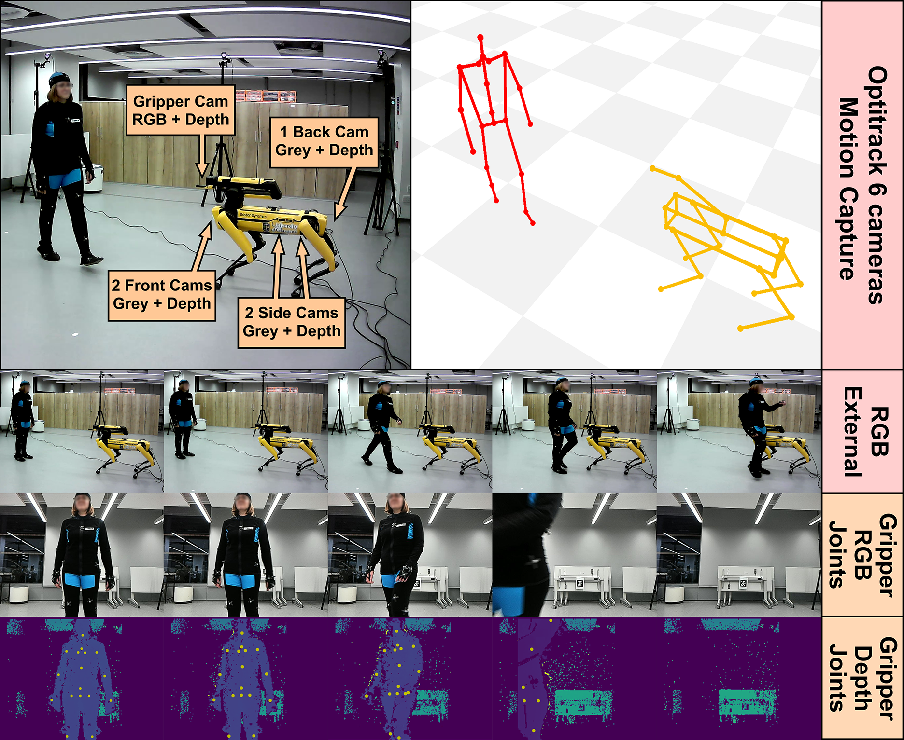

## Exploring 3D Human Pose Estimation and Forecasting from the Robot’s Perspective: The HARPER Dataset
### Andrea Avogaro, Andrea Toaiari, Federico Cunico, Xiangmin Xu, Haralambos Dafas, Alessandro Vinciarelli, Emma Li, and Marco Cristani
[](https://arxiv.org/abs/2403.14447)

This is the official code page for the **H**uman from an **A**rticulated **R**obot **Per**spective (**HARPER**) dataset!

Abstract:

We introduce **HARPER**, a novel dataset for 3D body pose estimation and forecast in dyadic interactions between users and Spot, the quadruped robot manufactured by Boston Dynamics. The key-novelty is the focus on the robot's perspective, i.e., on the data captured by the robot's sensors. These make 3D body pose analysis challenging because being close to the ground captures humans only partially. The scenario underlying **HARPER** includes 15 actions, of which 10 involve physical contact between the robot and users. The Corpus contains not only the recordings of the built-in stereo cameras of Spot, but also those of a 6-camera OptiTrack system (all recordings are synchronized). This leads to ground-truth skeletal representations with a precision lower than a millimeter. In addition, the Corpus includes reproducible benchmarks on 3D Human Pose Estimation, Human Pose Forecasting, and Collision Prediction, all based on publicly available baseline approaches. This enables future HARPER users to rigorously compare their results with those we provide in this work.

<p align="center">
    
</p>


<!-- ## Dataset Description
Refer to main paper - coming soon!

## Dataset Splits
Coming soon!
-->

<!-- ### NOTE
We are working hard to prepare the dataset for release, including instructions and baselines. 
Up to now, you can download the panoptic 3D data, particularly if you are interested in 3D human pose forecasting tasks.
The full dataset, including the robot's perspective, is coming soon! -->

## Dataset download

Run the following command to download the dataset:

```bash
PYTHONPATH=. python download/harper_downloader.py --dst_folder ./data
```

## 3D panoptic data
The dataset has two points of view: the panoptic point of view and the robot's perspective point of view. 
The first one is obtained using a 6-camera OptiTrack MoCap system. Thanks to it, the human skeleton pose (21x3) and the Spot skeleton can be located in the same 3D reference system.

For the sake of completeness, we provide the 3D panoptic data [here](https://univr-my.sharepoint.com/:f:/g/personal/federico_cunico_univr_it/Esk9qR4fKyFBg05UdXK0YSYBY8JvLHpY2Bis2xyX1pcVWg). 
To download and create the data structure with train and test splits you can use the following code:

```bash
PYTHONPATH=. python download/harper_only_3d_downloader.py.py --dst_folder ./data
```

This will generate the following tree structure:

```
data
├── harper_3d_120
│   ├── test
│   │   ├── subj_act_120hz.pkl
│   │   ├── ...
│   │   └── subj_act_120hz.pkl
│   └── train
│       ├── subj_act_120hz.pkl
│       ├── ...
│       └── subj_act_120hz.pkl
└── harper_3d_30
    ├── test
    │   ├── subj_act_30hz.pkl
    │   ├── ...
    │   └── subj_act_30hz.pkl
    └── train
        ├── subj_act_30hz.pkl
        ├── ...
        └── subj_act_30hz.pkl

```

In the `harper_3d_120` and `harper_3d_30` folders you will find the 3D panoptic data at 120 Hz and 30 Hz respectively, both with train and test split.

Each `.pkl` file contains a dictionary with the frame index as key and the following values:
- `frame`: the frame index
- `subject`: the subject id
- `action`: the action id
- `human_joints_3d`: the 3D human pose (21x3)
- `spot_joints_3d`: the 3D Spot pose (22x3)

A torch dataloader will be provided soon.

## Visualize the 3D panoptic data
To visualize the 3D panoptic data you can use the following code:

```bash
PYTHONPATH=. python tools/visualization/visualize_3d.py --pkl_file ./data/harper_3d_30/train/cun_act1_30hz.pkl
```

<!-- ## Citation
If you are using this dataset or you find useful for your research, cite us!
```
@article{avogaro2024exploring,
      title={Exploring 3D Human Pose Estimation and Forecasting from the Robot's Perspective: The HARPER Dataset}, 
      author={Andrea Avogaro and Andrea Toaiari and Federico Cunico and Xiangmin Xu and Haralambos Dafas and Alessandro Vinciarelli and Emma Li and Marco Cristani},
      year={2024},
      eprint={2403.14447},
      archivePrefix={arXiv},
      primaryClass={cs.CV}
}
```
-->
